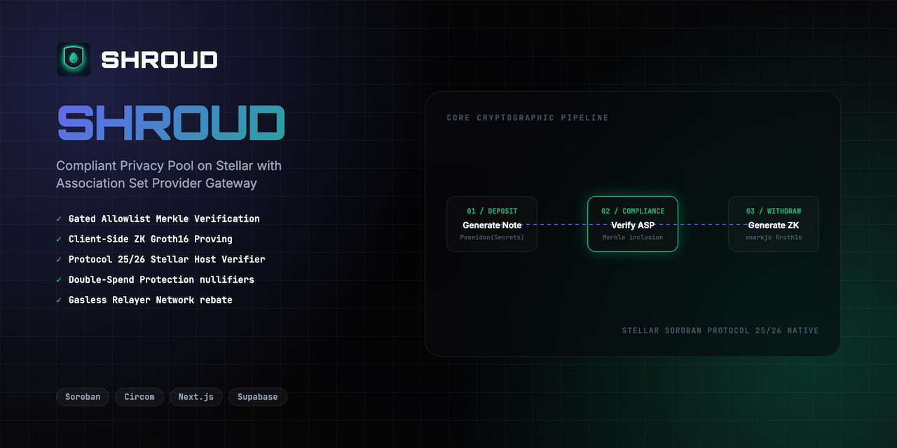
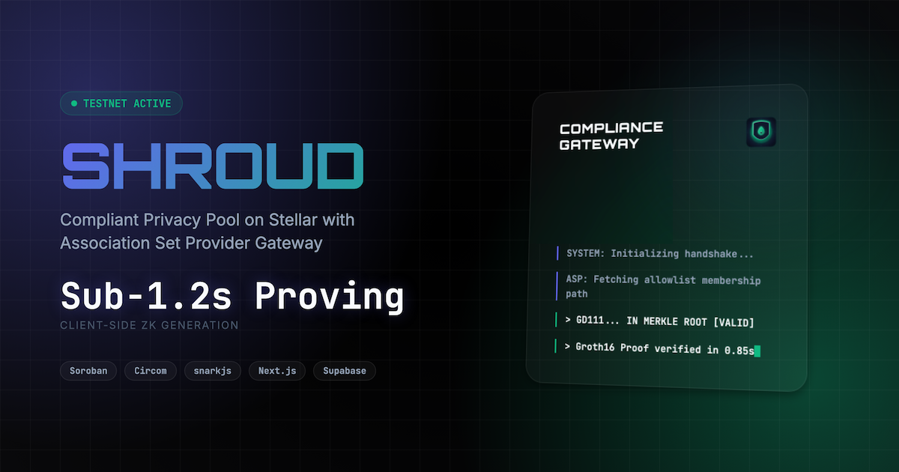
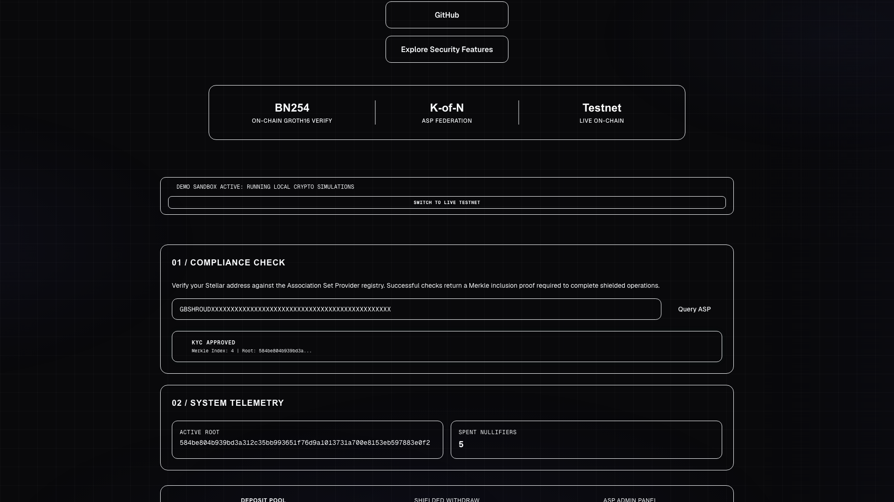
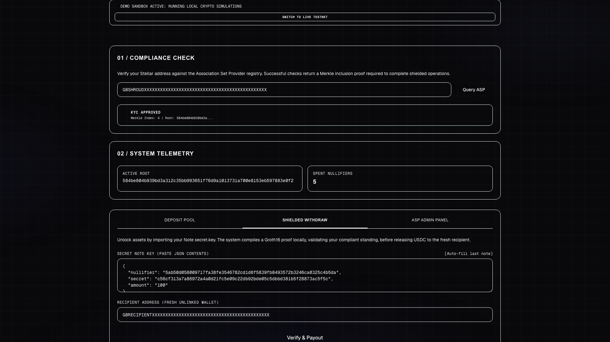
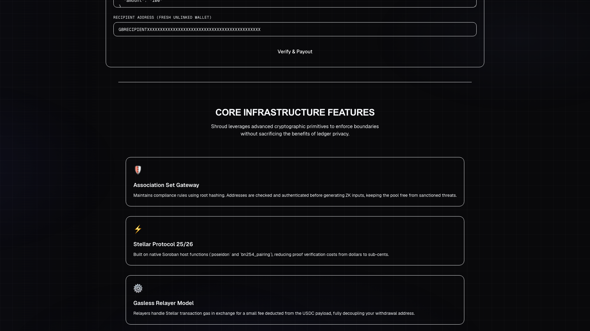
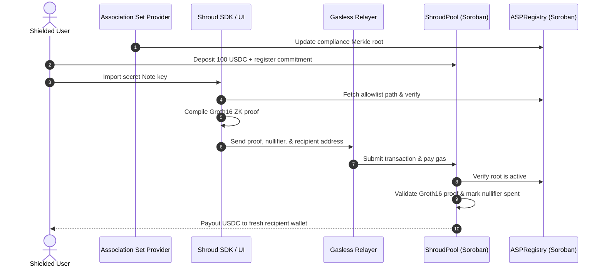
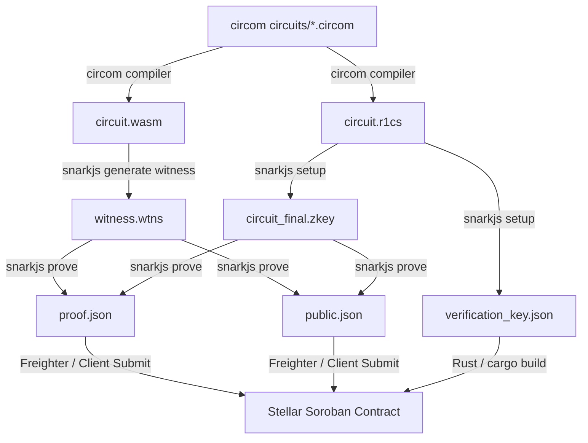

<div align="center">
  
  <h1>Shroud 👤</h1>
  <p><em>Compliant Privacy Pool with Association Set Provider Gateway on Stellar</em></p>
  

  <p><strong>✅ Real Groth16 (BN254) proof verified on Stellar testnet.</strong><br/>
  Reproduce with <code>npm run prove:demo</code> — groth16_verifier <code>CAM37IGZ44SKFE6SBWMCIKAGRHU7NCMIBONDZM3QHKIZ5DV4PWAH57GH</code>; a fresh snarkjs withdrawal proof makes <code>verify_proof</code> return true on-chain, and tampered inputs are rejected.<br/>
  <em>Honest status: the hosted web app is a demo sandbox (local crypto simulations for UX); the load-bearing ZK is the prove:demo pipeline plus the deployed contract.</em></p>

  <br/>

[](https://shroud.edycu.dev)
[](https://shroud.edycu.dev/pitch.html)
[](https://youtu.be/WhIzP_K0UBU)
[](https://dorahacks.io/hackathon/stellar-hacks-zk)

  <br/>


[](https://github.com/edycutjong/shroud/tree/main/contracts)

[](https://opensource.org/licenses/MIT)
[](https://github.com/edycutjong/shroud/actions/workflows/ci.yml)

</div>

---

## 🧩 Part of the Stellar ZK Suite

Five ZK-gated apps, one thesis: **real on-chain zero-knowledge on Stellar Soroban** (Protocol 25/26, native BN254 host functions). Each verifies a _fresh_ proof against a deployed testnet contract, reproducible with `npm run prove:demo` (valid proof ⇒ `true`, tampered ⇒ `false`). Built solo for **Stellar Hacks: Real-World ZK**.

| App | Proves privately | ZK stack | Links |
|---|---|---|---|
| 👤 **[Shroud](https://github.com/edycutjong/shroud)** ⭐ **flagship** | Compliant privacy pool — withdraw only if in the ASP compliance set | Circom · Groth16 (BN254) | [site](https://shroud.edycu.dev) · [video](https://youtu.be/WhIzP_K0UBU) |
| 🔬 **[Crisp](https://github.com/edycutjong/crisp)** | Proof-of-reserves — reserves ≥ liabilities, balances hidden | Circom · Groth16 (BN254) | [site](https://crisp.edycu.dev) · [video](https://youtu.be/fhVVoZKz7sI) |
| 🤫 **[Sotto](https://github.com/edycutjong/sotto)** | Sealed-bid auctions — winner is the lowest valid bid, losers hidden | Circom · Groth16 (BN254) | [site](https://sotto.edycu.dev) · [video](https://youtu.be/PAbWjCXx5XU) |
| 🔮 **[Obscura](https://github.com/edycutjong/obscura)** | B2B invoice settlement — within credit terms, no double-factoring | Noir · UltraHonk | [site](https://obscura.edycu.dev) · [video](https://youtu.be/PZ9tChsAwas) |
| 🦓 **[Zebra](https://github.com/edycutjong/zebra)** | Confidential payroll — KYC'd recipients + correct totals, salaries hidden | Noir · UltraHonk | [site](https://zebra.edycu.dev) · [video](https://youtu.be/KatlfYRjvw8) |

🚩 **Flagship: [Shroud](https://github.com/edycutjong/shroud)** — the compliant privacy pool (ASP gateway, per the SDF's recommended design). All five share the same circuits-to-Soroban verification harness.

---

## 💡 The Problem & Solution

**The Problem:** Privacy is essential for neobanks and corporate payroll payouts to prevent front-running by competitors. However, existing privacy mixers (like Tornado Cash) are uncompliant: they allow sanctioned actors to pool funds, leading to global regulatory blacklists and making privacy features unusable for regulated financial institutions.

**Shroud** solves this compliance-vs-privacy paradox by implementing the **Association Set Provider (ASP) Gateway** design recommended by the Stellar Development Foundation. Shroud makes privacy _conditional on compliance_. Users can deposit and withdraw USDC privately, but they must first cryptographically prove they belong to the ASP's compliance allowlist, keeping sanctioned addresses completely locked out.

---

## 📸 See it in Action

<div align="center">
  
</div>

<div align="center">
  
  
  
  <br/>
  <sub><em>Shielded deposit &amp; compliant withdrawal (demo sandbox). Reproduce the real proof with <code>npm run prove:demo</code>.</em></sub>
</div>

> **Compliant Privacy Withdrawal Flow:** Verify address KYC status on allowlist $\rightarrow$ Fetch Merkle inclusion path $\rightarrow$ Generate Groth16 Proof client-side in browser $\rightarrow$ Submit gasless relayer payload $\rightarrow$ Verify proof natively on-chain $\rightarrow$ Payout USDC to fresh wallet.

---

## ✅ Proof of On-Chain Verification (reproduce it)

`npm run prove:demo` generates a **fresh** BN254 Groth16 withdrawal proof and verifies it live on Stellar testnet. Example run:

```text
Generating real BN254 Groth16 proof (snarkjs.groth16.fullProve)...
off-chain verify: true
Invoking on-chain verify_proof on CAM37IGZ44SKFE6SBWMCIKAGRHU7NCMIBONDZM3QHKIZ5DV4PWAH57GH ...
on-chain verify_proof => true

✅ JS-generated proof accepted on-chain.
```

Valid proof ⇒ `true`; the tampered/negative control is covered by the verifier's `cargo test` suite.

- **Groth16 verifier (testnet):** [`CAM37IGZ…PWAH57GH`](https://stellar.expert/explorer/testnet/contract/CAM37IGZ44SKFE6SBWMCIKAGRHU7NCMIBONDZM3QHKIZ5DV4PWAH57GH)

---

## 🏗️ Architecture & Tech Stack



### ZK Compilation & Proving Toolchain Flow



**Tech Stack:**
| Layer | Technology |
|---|---|
| **Frontend** | Next.js 16 (App Router), React 19, Tailwind CSS v4 |
| **ZK Circuits** | Circom (Groth16), snarkjs WASM prover |
| **Smart Contracts**| Rust, Soroban SDK (Protocol 25/26) |
| **Database** | Supabase (PostgreSQL with RLS) |
| **Hosting** | Vercel (Frontend & Telemetry API) |

---

## 🏆 Sponsor Tracks Targeted

Shroud is built natively on Stellar because it is the only network supporting enterprise privacy features under sub-cent transaction costs. Shroud utilizes the following **6 load-bearing Stellar APIs**:

1.  **In-circuit Poseidon (Circom)**: ZK-friendly Poseidon hashes inside the off-chain withdrawal circuit keep the proof small.
2.  **`env.crypto().bn254().pairing_check()`**: Validates Groth16 pairing checks natively at host speed.
3.  **`env.storage().instance()`**: Persists spent nullifier maps to prevent double-spend attacks.
4.  **`env.events().publish()`**: Emits deposit events to let compliance servers build paths dynamically.
5.  **`token.transfer()`**: Performs secure locking of pool deposits and pay relayer rebates.
6.  **`address.require_auth()`**: Restricts compliance Merkle root rotations to the authorized admin.

### Honest Technical Limitations

1.  **ASP Centralization**: The base flow uses a single ASP root. The v3 `asp_registry` federation (Phase 7a, deployed) addresses this with a K-of-N operator threshold; the live pool can be pointed at the federation registry to require multi-operator agreement on the compliance root.
2.  **Root Timing Delay**: If the Merkle root rotates on-chain right before a transaction, the proof fails validation, requiring the user to re-prove.

## ⛓️ Smart Contract Specifications

### Compiler Requirements

Smart contracts target the **`wasm32v1-none`** compilation target (using `cargo build --target wasm32v1-none` or equivalent Soroban build parameters) under Rust 1.82+ to ensure compatibility with Stellar's Protocol 25/26 BN254 EC pairing host functions.

### Deployed Contract Details

- **Groth16 Verifier Contract:** `CAM37IGZ44SKFE6SBWMCIKAGRHU7NCMIBONDZM3QHKIZ5DV4PWAH57GH`
- **Shroud Pool & Registry Contracts:** Deployed locally/testnet dynamically during setup.

### Contract Endpoints & Parameters

#### 1. ShroudPool

Manages shielded deposits and withdrawals:

- `initialize(env: Env, token: Address, verifier: Address, registry: Address)`: Set the token (USDC), ZK verifier, and ASP compliance registry addresses.
- `deposit(env: Env, depositor: Address, commitment: BytesN<32>, amount: u128)`: Deposit USDC into the pool and register the commitment hash (depositor auth required).
- `withdraw(env: Env, proof: Bytes, public_inputs: Vec<Bytes>, recipient: Address, relayer: Address, amount: u128, relayer_fee: u128)`: Perform shielded withdrawal by verifying the Groth16 note proof against 6 public inputs: `[deposit_merkle_root, compliance_merkle_root, nullifier_hash, recipient_address, ownerAx, ownerAy]`. Nullifies the spent note and pays USDC to the recipient.

#### 2. ASPRegistry

Maintains compliance-set allowlist commitments:

- `initialize(env: Env, admin: Address)`: Set admin address.
- `set_root(env: Env, new_root: BytesN<32>)`: Rotate compliance Merkle root (admin auth required).
- `get_root(env: Env) -> BytesN<32>`: Retrieve active compliance Merkle root.

#### 3. Groth16Verifier

Performs ZK pairing check for note proofs:

- `initialize(env: Env, alpha: Bytes, beta: Bytes, gamma: Bytes, delta: Bytes, ic: Vec<Bytes>)`: Set Groth16 verification key points.
- `verify_proof(env: Env, proof: Bytes, public_inputs: Vec<Bytes>) -> bool`: Verify Groth16 proof (a, b, c) against public inputs.

### 🔭 v3 extensions — deployed as dedicated contracts, not wired into the demo web app

> **Honest status:** the v1 pool/verifier handle the shielded `deposit`/`withdraw` Groth16 proof. The v3 cross-pool atomic swap ships as a **dedicated cross-pool verifier** (circuit `circuits/cross_pool.circom`), and the multi-ASP K-of-N federation ships in the `asp_registry` — both verified on Stellar testnet and reproducible from the CLI (see Roadmap below). Neither is **wired into the hosted demo web app**, which demos the v1 flow only.

- `initiate_cross_pool_swap(...)` / `complete_cross_pool_swap(...)` **[v3, shipped]** — Cross-pool atomic swap: a ZK proof of value conservation across pools (`input_a × fx_numerator == output_b × fx_denominator`), spending the input nullifier and registering the output commitment, against a dedicated cross-pool VK on testnet verifier `CDEEOEOHKMDVVIIWOKMQ6L4NZCXFAEDKYPCEI3GGRXUQPSOIMQJGQS6R`. Reproduce: `npm run prove:demo:crosspool`.

---

## 🚀 Getting Started

### Prerequisites

- Node.js &ge; 20
- Rust (Cargo workspace compiler)

### Installation & Run

```bash
# Clone the repository
git clone https://github.com/edycutjong/shroud.git
cd shroud

# Install packages & run next.js local development
npm install
npm run dev
```

---

## 🧪 Testing & CI

**6-stage pipeline:** Quality (Node version matrix check + Cargo check) &rarr; Security &rarr; Build &rarr; E2E (Playwright) &rarr; Performance &rarr; Deploy Gate

```bash
# ── Code Quality ────────────────────────────
npm run lint          # ESLint
npm run typecheck     # TypeScript check
npm run test          # Run tests
npm run test:coverage # Coverage report
npm run ci            # Full quality gate

# ── Advanced Testing ────────────────────────
npm run e2e           # Playwright E2E tests
npm run e2e:ui        # Playwright interactive mode
npm run lighthouse    # Lighthouse CI audit

# ── Security ────────────────────────────────
make security-scan    # npm audit + license check
```

| Layer           | Tool                           | Status |
| --------------- | ------------------------------ | ------ |
| Code Quality    | ESLint + TypeScript            | ✅     |
| Unit Testing    | Custom Node Runner (100 tests) | ✅     |
| E2E Testing     | Playwright (3 suites)          | ✅     |
| Security (SAST) | CodeQL                         | ✅     |
| Security (SCA)  | Dependabot + npm audit         | ✅     |
| Secret Scanning | TruffleHog                     | ✅     |
| Performance     | Lighthouse CI                  | ✅     |

---

## 📁 Project Structure

```
dorahacks-stellarzh-shroud/
├── .github/           # GitHub Action CI Workflows
├── circuits/          # ZK Prover Circom files
├── contracts/         # Soroban Smart Contracts (Rust)
├── db/                # Supabase schema definitions
├── docs/              # Readme Assets & Pitch Decks
├── e2e/               # Playwright integration tests
├── public/            # Static assets
├── scripts/           # Test runners and benchmarks
├── src/
│   ├── app/           # Next.js App routing
│   └── sdk/           # Shroud cryptographic SDK helper
├── Makefile           # Advanced quality scripts
└── README.md          # You are here
```

---

## 📽️ Demo Materials

- **GitHub Repository**: [https://github.com/edycutjong/shroud](https://github.com/edycutjong/shroud)
- **Live App URL**: [https://shroud.edycu.dev](https://shroud.edycu.dev)
- **Pitch Deck**: [https://shroud.edycu.dev/pitch.html](https://shroud.edycu.dev/pitch.html)
- **Developer Experience Log**: [`docs/DX-REPORT.md`](docs/DX-REPORT.md)
- **Security Audit Details**: [`docs/AUDIT_REPORT.md`](docs/AUDIT_REPORT.md)

## 📊 Performance & Gas Benchmarks

Shroud verifies compliant privacy pool withdrawals natively on Stellar using native BN254 pairings via Protocol 25/26 host functions. Below are the resource costs measured on-chain during unit tests:

| Operation           | CPU Instructions | Memory (Bytes) | % of Limit |
| ------------------- | ---------------- | -------------- | ---------- |
| Pool Initialization | 14,488           | 0              | ~0.01%     |

_Benchmarks ran locally using the Soroban Rust SDK test environment (Protocol 26). Full Groth16 verification costs vary with circuit complexity._

---

## 🗺️ Roadmap

- [x] Phase 1: Core Groth16 withdrawal circuit with ASP Merkle proof (Circom)
- [x] Phase 2: Soroban privacy pool + ASP registry + Groth16 verifier contracts
- [x] Phase 3: Client-side commitment generation and browser proving
- [x] Phase 4: Freighter wallet integration and Next.js compliance portal
- [x] Phase 5: 6-stage engineering harness (Quality → Security → Build → E2E → Perf → Deploy)
- [x] Phase 6: Cross-pool atomic swaps with ZK balance conservation proof (v3) — **shipped & verified on-chain.** Real `cross_pool.circom` Groth16 circuit (value conservation at a proven FX rate + Poseidon Merkle membership in Pool A + output commitment + swap-hash binding) → BN254 proof → on-chain `verify_proof` against a dedicated cross-pool VK on testnet verifier `CDEEOEOHKMDVVIIWOKMQ6L4NZCXFAEDKYPCEI3GGRXUQPSOIMQJGQS6R`. Reproduce: `npm run prove:demo:crosspool` (real proof → `true`, tampered inputs → `false`). Covered by `test_real_crosspool_proof_verification`.
- [x] Phase 7a: **Multi-ASP federation — shipped & verified on-chain.** `asp_registry` extended with a K-of-N operator federation: `register_asp` enrolls operators, `set_threshold` sets K, `attest_root` lets each registered operator attest a compliance root, and a root is `is_root_approved` (and adopted as the live `get_root`) only once K distinct operators agree — removing the single-ASP trust assumption. Live registry `CADP225KUYYG7IX42KGWFS4ED4YGDQVACDPTGXJY6PUSVLUKPIBYC7DT` (N=2, K=2). Reproduce: `npm run demo:federation` (1 attestation → not approved, 2 → approved + adopted). Covered by `test_federation_*`.
- [ ] Phase 7b: Cross-chain compliance interop — _designed, not deployed (requires external cross-chain bridges / light clients)_

---

## 📄 License

[MIT](LICENSE) © 2026 Edy Cu
